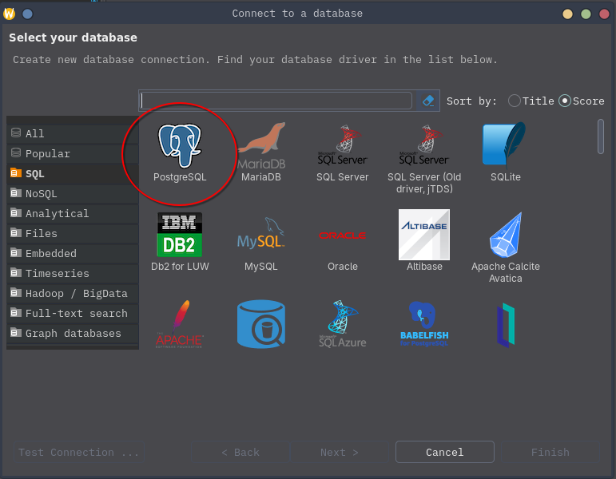
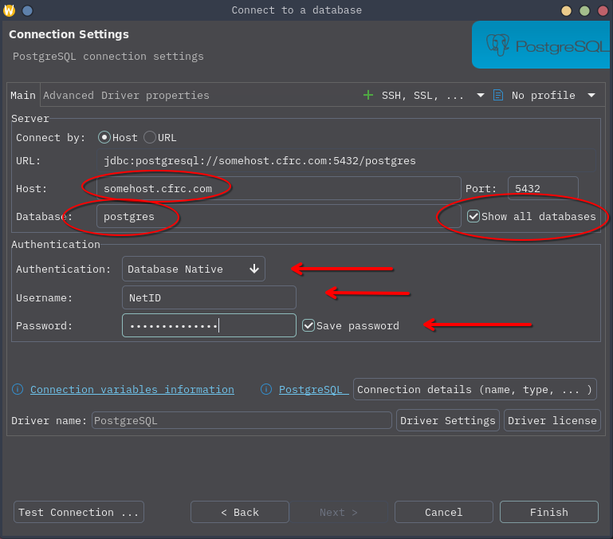

# Create New Connection

## Create a new connection
Start by creating a new connection in DBeaver. This can be initiated from the "File" menu, or from the icon just under the "File" menu (it looks like an electrical plug and a "+" sign).

## Select PostgreSQL
After initiating the New Database Connection wizard, you will be presented with a list of database types. For most CFRC databases, you will need to select the "PostgreSQL" database.

Select "PostgreSQL" and click "Next".

## Connection Details

### Main
On the next screen, populate the "Host", "Database", "Username", and "Password" fields. Also make sure that the "Show all databases" option is checked, and that the authentication type is "Database Native". The "Host" and "Database" options should be provided by your administrator. The username and password will be your NetID username and password.

Press "Finish".

At this point, feel free to rename the connection to something more sensible.
