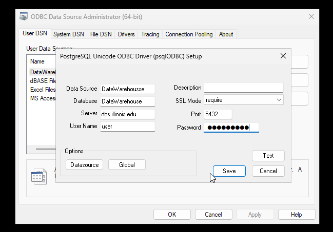

# ODBC Connection Setup

ODBC connections are a method of accessing many database types through "ODBC" drivers. Many statistics softwares, such as Stata and SPSS, require ODBC connections on Windows in order to access database servers.

## ODBC setup

ODBC connections are setup through the Windows "ODBC Data Source Administrator".

1. Start by clicking on your Start menu (in Windows) and type/search "ODBC". You should see the "ODBC Data Sources (64-bit)" application appear in the menu (click on this).

    

2. On the "ODBC Data Source Administrator (64-bit), make sure the "User DSN" tab is selecetd, then click on "Add" to add a new connection.

3. From the list of available drivers, select "PostgreSQL Unicode(x64)" and click "Finish".

    

4. On the screen that appears, you are given various connection paramters. You may enter anything you feel is appropriate for the "Data Source" and "Description" fields. For specifics as to what should be filled in these fields, please contact your CFRC database administrator.

    

5. Click "Test". If this step succeeds, click "Save" to complete the setup. If this step fails, please verify that all entries are correct, retype your password, and test again. If your connection test continues to fail, please contact your administrator.
