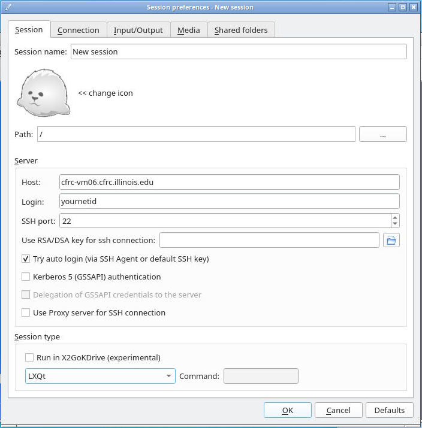

# \[DRAFT\]

Virtual Desktops for statistics running Linux is available for SAS and
Python.

# X2Go Setup

Start by opening X2Go, and selecting **Session** \> **New session**.



This will open a new window to configure your new session. On the
*Session* tab, make sure to add:

- Session name: Choose a specific name…
- Host: cfrc-vm06.cfrc.illinois.edu (OR cfrc-vm07.cfrc.illinois.edu)

Pick only one, but you may want to set up a new session for each host.

- Login: This should be your NetID
- “Try auto login (via SSH Agent or default SSH key): Checked
- Session type:
  - LXQt
  - XFCE
  - Custom Desktop (Enter "openbox-kde-session") in the "Command" field.

On the *Connection* tab: Set the speed accordingly. If you are on
campus, set this to "LAN". If you are off campus, "ADSL" or "WAN" may be
better optiions.

*Input/Output* tab:

- Set display DPI:

This can be left unchecked, but if you choose to set it, this setting
may affect your SAS font size. A setting such as "96" or "124" may be
good choices if you desire this effect.

- Xinerama extension: Checked

*Media* tab:

- Sound:
  - Enable sound support: unchecked

*Shared folders*:

- Folders: Here, you will want to add any local folders that you wish to
  access on the virtual machine. One option is to add your entire home
  directory. After selecting and adding any folder(s) you wish, make
  sure "Automount" is checked for each. These directories will be
  mounted in your /home//media directory on the virtual machine.
- Use SSH port fowarding: checked

Finish the configuration by clicking "OK".

# SAS

## includes.sas

You have a hidden folder in your home directory named ".sas". When SAS
is loaded, "~/.sas/includes.sas" will be loaded in the background. In
this *includes.sas* file, you can execute SAS code that you may want to
be accessible when you run other programs. This may be useful for thinks
like setting global variables.

In particular, this may help you access mounted folders on your local
desktop from SAS without having to specify a long path in each SAS
program.

An example *includes.sas*:

``` bash
%let user = &SYSUSERID;
%let path = /home/&user/media/disk/_home_&user/path/to/SAS/programs/;
```

## .sasv9.cfg

Please make use of a custom SAS configuration file, such as ~/.sasv9.cfg
to specify a work directory. SAS by default will use /tmp to save your
SAS work directory, but this causes problems on a shared system. It is
better to set this to a location in your home directory. Make sure that
SAS is exited properly when you are finished, and periodically inspect
your SAS work directory to make sure it isn't growing too large. See the
official SAS documentation for more information on acceptable SAS user
configuration files.

An emample *~*.sasv9.cfg/:

``` bash
-WORK /SASWORK/
```

# Git clients

Git clients are installed on the virtual machines, but it is preferable
to mount any git repositories and access git locally. This prevents you
from having to forward SSH keys to the virtual machines.
